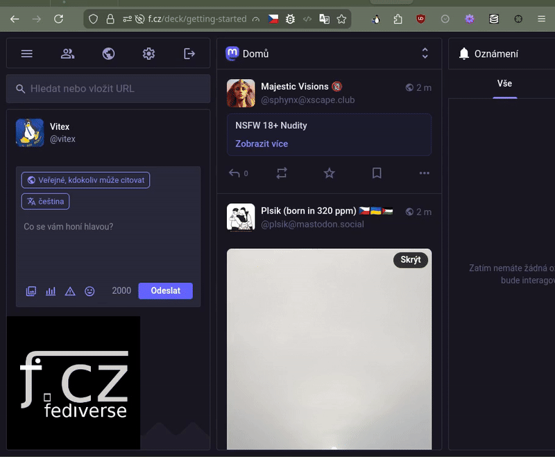

# Anhilate WebExtension


Anhilate is a powerful browser extension for Firefox, Chrome, and Edge that allows you to visually select and permanently remove any HTML element from a webpage. It's a handy tool for decluttering pages, removing distractions, or temporarily tidying up a site for a screenshot.

## Demo



## Features

*   **One-Click Activation:** Activate the element selection mode with a single click on the toolbar icon or by using a keyboard shortcut (`Ctrl+Shift+X`).
*   **Precise Element Selection:** Once activated, your cursor turns into a crosshair. As you move it across the page, elements are highlighted with a blue overlay, showing you exactly what you're about to remove.
*   **DevTools-Style Highlighting:** The highlighting is designed to mimic the familiar look and feel of your browser's developer tools inspector.
*   **Click to Remove:** A simple click on the highlighted element is all it takes to make it disappear.
*   **Customizable Animation Effects:** Choose between simple implosion or spiral animation effects in the extension settings.
*   **Visual Feedback:** The toolbar icon changes color when the element selector is active.
*   **Keyboard Support:** In addition to clicking, you can also remove the highlighted element by pressing the `Enter` key.
*   **Easy Deactivation:** You can cancel the selection mode at any time by pressing the `Escape` key or by clicking the toolbar icon again.
*   **Lightweight and Fast:** Anhilate is built with pure JavaScript and CSS, with no third-party libraries, ensuring it's fast and won't slow down your browsing.

## Installation

### For Firefox

**Install from Mozilla Add-ons:** [Get Anhilate on Firefox Add-ons](https://addons.mozilla.org/firefox/addon/anhilate/)

**Or install manually:**

1.  Download the latest release from the [releases page](https://github.com/Vitexus/anhilate/releases) (or clone this repository).
2.  Open Firefox and navigate to `about:debugging`.
3.  Click on "This Firefox" in the left-hand menu.
4.  Click on the "Load Temporary Add-on..." button.
5.  Navigate to the `anhilate` directory and select the `manifest.json` file.

### For Chrome and Edge

1.  Download the latest release from the [releases page](https://github.com/Vitexus/anhilate/releases) (or clone this repository).
2.  Open Chrome or Edge and navigate to `chrome://extensions`.
3.  Enable "Developer mode" using the toggle switch in the top-right corner.
4.  Click on the "Load unpacked" button.
5.  Select the `anhilate` directory.

The extension is now installed and ready to use.

## How to Use

1.  **Activate:** Click the Anhilate icon in your browser's toolbar or press `Ctrl+Shift+X`. Your cursor will change to a crosshair, and the selection mode will be active.
2.  **Select:** Move your cursor over the webpage. The element directly under the cursor will be highlighted with a blue overlay.
3.  **Remove:**
    *   **With your mouse:** Click on the highlighted element.
    *   **With your keyboard:** Press the `Enter` key.
4.  **Deactivate:**
    *   Press the `Escape` key.
    *   Click the Anhilate toolbar icon again.

The selection mode will also automatically deactivate after you remove an element.

## Repository Structure

```
anhilate/
├── manifest.json         # The extension's manifest file
├── background.js         # Handles activation, deactivation, and state management
├── content.js            # Injected into the webpage to load the selector
├── selector.js           # The core logic for element selection and removal
├── implosion.css         # The CSS for the implosion animation
├── icons/                # Directory for the extension's icons
│   ├── 16.png
│   ├── 32.png
│   ├── 48.png
│   └── 128.png
└── README.md             # This file
```

## Contributing

Contributions are welcome! Please feel free to open an issue or submit a pull request if you have any suggestions or improvements.
